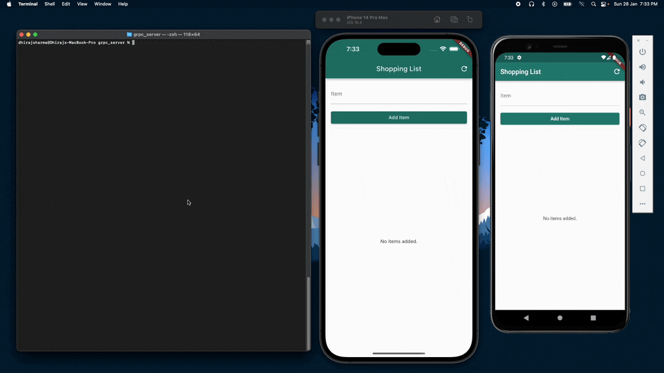

# Flutter gRPC Shopping List

Welcome to the Flutter gRPC Shopping List project! This project is designed to explore gRPC communication between a Dart gRPC server and a Flutter client. The primary focus is on creating a simple shopping list application usin gRPC.

## Overview

- **Server:** Dart gRPC server handles the backend logic, providing functionality for managing a shopping list. [Further Details
](https://github.com/sharmadhiraj/Flutter-gRPC-Shopping-List/blob/main/grpc_server/README.md)
- **Client:** Flutter app acts as the frontend, allowing users to interact with the shopping list through a user-friendly interface. [Further Details
](https://github.com/sharmadhiraj/Flutter-gRPC-Shopping-List/blob/main/grpc_client/README.md)

## Features

- **Add Items:** Users can add items to the shopping list.
- **List Items:** Display the current items in the shopping list.
- **Delete Items:** Remove items from the shopping list.

## Demo

